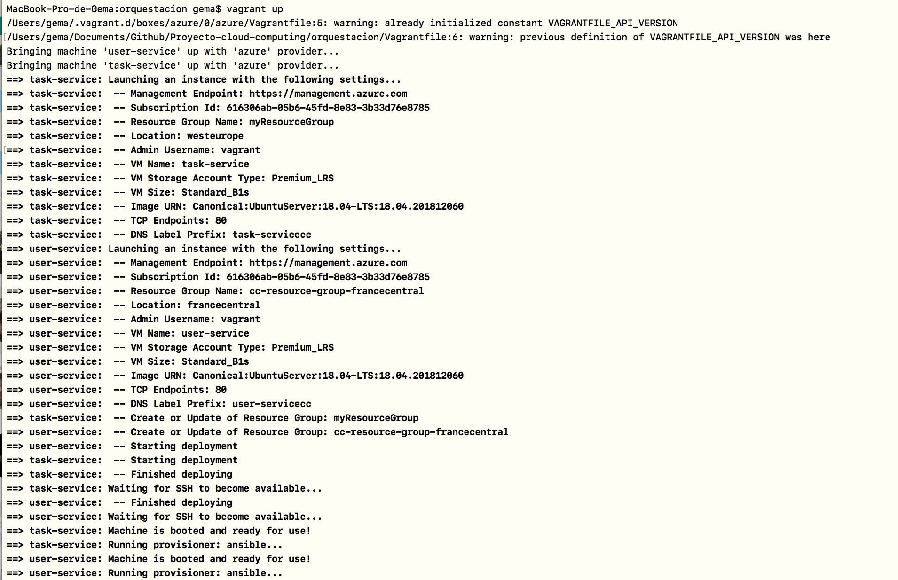
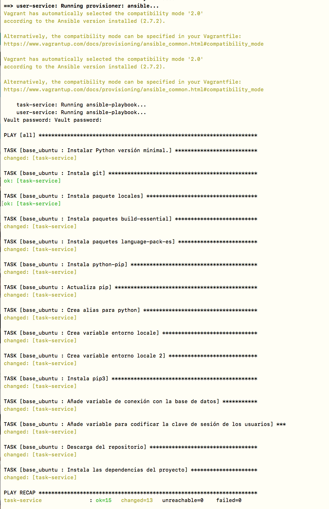
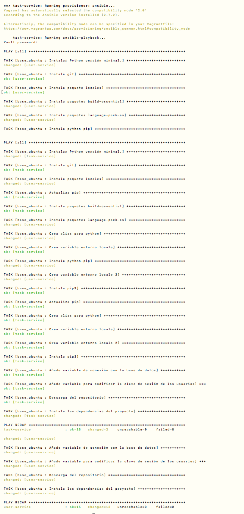
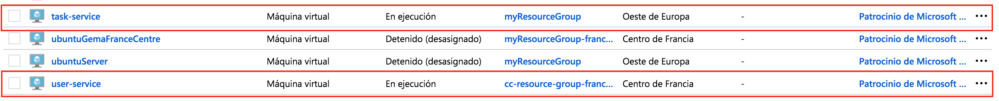
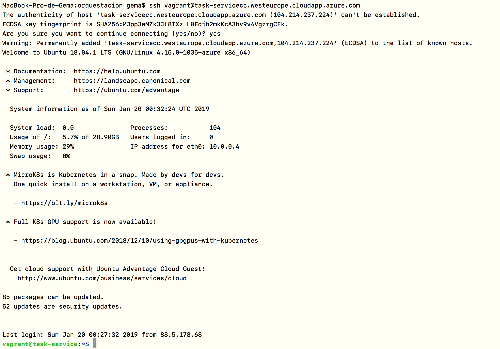
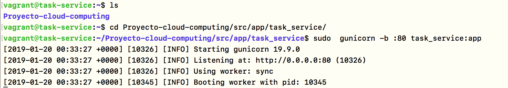
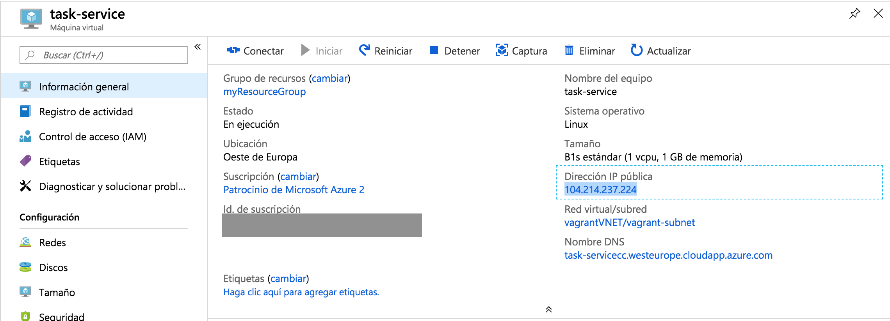
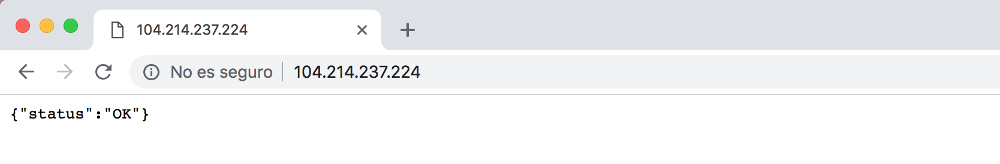

# Comprobación a **[@jmv74211](https://github.com/jmv74211/Proyecto-cloud-computing)** del Hito 5

**Comprobación realizada por Gema Correa ([@Gecofer](https://github.com/Gecofer/proyecto-CC))**

## Proceso de comprobación

En primer lugar se ha realizado un `fork` del repositorio y se ha clonado dicho fork a mi disco local. A continuación, nos situamos en el directorio de _orquestacion_ y lanzamos `vagrant up` para crear las dos máquinas virtuales. Podemos ver que la creación se ha realizado con éxito para las dos máquinas virtuales.

Seguidamente se pasa al aprovisionamiento de ambas máquinas virtuales, en donde primero se realiza para la máquina user-service y luego para task-service.

Una vez que tenemos ambas máquinas creadas, nos dirigimos a Azure, y comprobamos que efectivamente están.

Una vez que se han creado las máquinas virtuales, se accede a la máquina de task-service con:

~~~
$ ssh vagrant@task-servicecc.westeurope.cloudapp.azure.com
~~~

Una vez dentro, hacemos `cd Proyecto-cloud-computing/src/app/task_service/` y lanzamos el servicio con `sudo  gunicorn -b :80 task_service:app`.

Obtenemos la IP de la máquina en Azure y comprobamos:

Entonces podemos concluir que **LA ORQUESTACIÓN DE MÁQUINAS VIRTUALES SE HA REALIZADO CON ÉXITO**.
